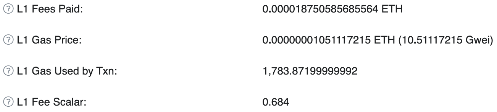
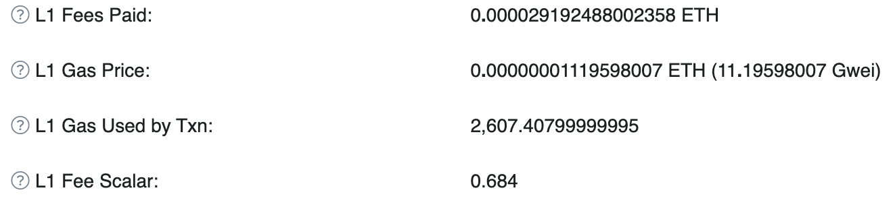

<h1>be calldata gas optimizooor!! </h1>

A CLI that goes along with building blocks of smart contract. Along with our front-end snippets, this toolbox can reduce L2 gas cost by encoding calldata for dApps development to use as little bytes of calldata as possible. 

> **Note**💡

> The code is not audited yet. Please use it carefully in production.

- [What is it for](#what-is-it-for)
- [How It Works](#how-it-works)
- [Benchmarks](#benchmarks)
- [Installation](#installation)
- [Quickstart](#quickstart)
- [Contributing](#contributing)
- [Architecture](#architecture)


## What is it for ?

This dApp building block is intended to reduce L2 gas costs by a significant amount, using calldata optimization paradigm.

While security is our top priority, we aim to enhance developer experience, such that the entire protocol is not required to re-written from scratch.

What you need to do is specify how argument is packed into one single calldata, then our CLI will generate required files for you !!


## How It Works

It works by optimizing calldata by using as little bytes of calldata as possible.

Specifically, Our novel components are as follows:

1. Solidity snippets: one contract to encode call data on chain. Another to decode it. This component has following feat:

   - AddressTable: to store **the mapping between addresses and indexes**, allowing:
     - The **address** can be registered to the contract, then the index is generated.
     - The generated id can then be used  to look up the registered address  during the compressed **call data** **decoding** process
   - Data Serialization, allowing:
     - The encoded calldata could be deserialized into the correct type with adequate data size.
     - For example, if we choose to reduce the calldata by sending the time period as arguments with type of uint40 (5 bytes) instead of uint256, the calldata should be sliced at the correct offset and the result can be correctly used in the next steps.

2. Front-end snippets: to atomically connect between encoding and decoding component into single call

    - The demo of how to implement front-end part is here:[ `uniswap-calldata-optimization-monorepo`](https://github.com/Ratimon/uniswap-calldata-optimization-monorepo)

3. CLI: to generate the above solidity snippets (including Encoder and Decoder contracts). The only task requires to do is to specify the data type to pack the calldata while ensuring security.


## Benchmarks

### Benchmarks - on Mainnet!!

We have done the benchmark by deploying and interacting the **un-optimized version** : [`/UniswapV2Router02.sol`](https://github.com/Ratimon/uniswap-calldata-optimization-monorepo/blob/main/contracts/src/UniswapV2Router02.sol) and **optimized version** [`/UniswapV2Router02_Optimized.sol`](https://github.com/Ratimon/uniswap-calldata-optimization-monorepo/blob/main/contracts/src/UniswapV2Router02_Optimized.sol).

Then, we have compared the difference in gas cost in following Txs:

1. [`https://optimistic.etherscan.io/tx/0x446b8d7f091ff258d16dfbac751797210ad1edeb5f856c0ac0686b80d32516a5`](https://optimistic.etherscan.io/tx/0x446b8d7f091ff258d16dfbac751797210ad1edeb5f856c0ac0686b80d32516a5)

The L2 Fees Paid is then 0.00011025.



2. [`https://optimistic.etherscan.io/tx/0x778a6beb856540c5534d7516fa168e0b26b09086e414317748ac01c153e81f01`](https://optimistic.etherscan.io/tx/0x778a6beb856540c5534d7516fa168e0b26b09086e414317748ac01c153e81f01)


The L2 Fees Paid is then 0.00007481

It can be seen that the L1 gas has been saved by ~36% (from 0.000029 ETH to 0.000018 ETH), but the overall cost is higher. However, the gas amount saved can potentially be much higher in case of the high congestion on L1 network.

For example if L1 gas price increases to 100 Gwei and L1 Fee Scalar is adjusted to 1. The figures will be from 0.000424 ETH to 0.000263 ETH.

According to the formula: 

$`\
\text{Total Gas} = \text{Gas Price}_{\text{Layer2}} \times \text{Gas Used for Execution}_{\text{Layer2}} +  \text{Gas Price}_{\text{Layer1}} \times \text{Gas Used for Data}_{\text{Layer2}}  \times \text{Scalar Fee}_{\text{Layer1}} `$

The total fee for unoptimized contract is 0.00007481 + 0.000424 = 0.0004988.

The total fee for optimized contract is 0.00011025 + 0.000263 = 0.00034325.

The gas has been saved by 31 %

### Benchmarks - Behind the scene

We provide how the UniswapV2's router is optimized as follows:

- The original version:[ `UniswapV2Router02.sol`](https://github.com/Ratimon/solid-grinder/blob/main/contracts/examples/uniswapv2/UniswapV2Router02.sol)

```solidity
    /** ... */
    contract UniswapV2Router02 is IUniswapV2Router02 {

        /** ... */

        function addLiquidity(
            address tokenA,
            address tokenB,
            uint256 amountADesired,
            uint256 amountBDesired,
            uint256 amountAMin,
            uint256 amountBMin,
            address to,
            uint256 deadline
        ) public virtual override ensure(deadline) returns (uint256 amountA, uint256 amountB, uint256 liquidity) {
            /** ... */
        }
        /** ... */
    }

```

- The optimized version: including two components. The first one is [ `UniswapV2Router02_Optimized.sol`](https://github.com/Ratimon/solid-grinder/blob/main/contracts/examples/uniswapv2/UniswapV2Router02_Optimized.sol) which inherits main functionality from [ `UniswapV2Router02_Decoder.g.sol`](https://github.com/Ratimon/solid-grinder/blob/main/contracts/examples/uniswapv2/decoder/UniswapV2Router02_Decoder.g.sol)

```solidity

    /** ... */
    contract UniswapV2Router02_Optimized is UniswapV2Router02, Ownable, UniswapV2Router02_Decoder {

        /** ... */

        function addLiquidityCompressed(bytes calldata _payload)
            external
            payable
            returns (uint256 amountA, uint256 amountB, uint256 liquidity)
        {
            (addLiquidityData memory addLiquidityData,) = _decode_addLiquidityData(_payload, 0);

            return UniswapV2Router02.addLiquidity(
                addLiquidityData.tokenA,
                addLiquidityData.tokenB,
                addLiquidityData.amountADesired,
                addLiquidityData.amountBDesired,
                addLiquidityData.amountAMin,
                addLiquidityData.amountBMin,
                addLiquidityData.to,
                addLiquidityData.deadline
            );
        }
        /** ... */
  
    }

```

The second one is [ `UniswapV2Router02_Encoder.sol`](https://github.com/Ratimon/solid-grinder/blob/main/contracts/examples/uniswapv2/encoder/UniswapV2Router02_Encoder.g.sol)

```solidity

    /** ... */
   contract UniswapV2Router02_Encoder {
    IAddressTable public immutable addressTable;

        /** ... */

        function encode_addLiquidityData(
            address tokenA,
            address tokenB,
            uint256 amountADesired,
            uint256 amountBDesired,
            uint256 amountAMin,
            uint256 amountBMin,
            address to,
            uint256 deadline
        )
            external
            view
            returns (
                bytes memory _compressedPayload
            )
        {
            /** ... */
        }

        /** ... */

    }

```

As shown above, the various input arguments of original contract are compressed into a single calldata via **encoder**. It is then decoded to be used later in **decoder**. Thus, nearly half bytes of calldata is reduced.

This can be illustrated by following:

- This command shows how solidity encodes an original function with arguments:

```sh
cast calldata "addLiquidity(address,address,uint256,uint256,uint256,uint256,address,uint256)" 0x106EABe0298ec286Adf962994f0Dcf250c4BB763 0xEbfc763Eb9e1d1ab09Eb2f70549b66682AfD9aa5 1200000000000000000000 2500000000000000000000 1000000000000000000000 2000000000000000000000 0x095E7BAea6a6c7c4c2DfeB977eFac326aF552d87 100
```

- The result has the total bytes count of 520 hexa = 520/2 = 260 bytes:

```sh
0xe8e33700000000000000000000000000106eabe0298ec286adf962994f0dcf250c4bb763000000000000000000000000ebfc763eb9e1d1ab09eb2f70549b66682afd9aa50000000000000000000000000000000000000000000000410d586a20a4c000000000000000000000000000000000000000000000000000878678326eac90000000000000000000000000000000000000000000000000003635c9adc5dea0000000000000000000000000000000000000000000000000006c6b935b8bbd400000000000000000000000000000095e7baea6a6c7c4c2dfeb977efac326af552d870000000000000000000000000000000000000000000000000000000000000064
```

- This command shows how our optimized version encodes various input arguments into single tightly compressed calldata.

```sh
cast calldata "addLiquidityCompressed(bytes)" 000001000002000000410d586a20a4c00000000000878678326eac9000000000003635c9adc5dea000000000006c6b935b8bbd4000000000030000000064
```

- The result has the total bytes count of 264 hexa = 264/2 = 132 bytes:

```sh
0x2feccbed0000000000000000000000000000000000000000000000000000000000000020000000000000000000000000000000000000000000000000000000000000003e000001000002000000410d586a20a4c00000000000878678326eac9000000000003635c9adc5dea000000000006c6b935b8bbd40000000000300000000640000
```

Hence, this saves bytes by around 50% of calldata. This figure is quite impactful when implementing on dApp deployed on L2 (like Arbitrum/ Optimism) where L2 users pay their significant portion of L1 security cost of batch submission. The L1 gas could possibly be most of the total gas cost (L1 + 2 gas).

This essentially means that either the fewer bytes of call data sent or the tighter packed call data, the lower gas users will pay on L2.

As a result, our optimized version of UniswapV2's router could potentially save nearly 50%  of gas on L2.

> **Note**💡

> The gas amount saved heavily depends on L1 security cost which can vary, depending on the congestion on L1.

Mathematically, the total gas is the total of the L2 execution fee and the L1 data/security fee, and this figure is differently calculated, depending on different layer 2 chains.

### Arbitrum

$`\
\text{Total Gas Fee}_{\text{Layer2}} = \text{Execution Fee}_{\text{Layer2}} + \text{Data Fee}_{\text{Layer1}} `$

where $`\ \text{Execution Fee}_{\text{Layer2}} `$ is :

$`\
\text{Execution Fee}_{\text{Layer2}} = \text{Gas Price}_{\text{Layer2}} \times \text{ Gas Used}_{\text{Layer2}}`$

$`\
text{Gas Price}_{\text{Layer2}} = \min( \text{Base Fee}_{\text{Layer2}} + \text{Priority Fee}_{\text{Layer2}} , \text{Gas Price Floor} )`$


$`\
\text{where} \quad \text{Gas Price Floor} = 
\begin{cases}
0.1 \, \text{Gwei}, & \text{on Arbitrum One} \\
0.01 \, \text{Gwei}, & \text{on Nova}
\end{cases}`$

and  $`\ \text{Data Fee}_{\text{Layer1}} `$ is : 

$`\
\text{Data Fee}_{\text{Layer1}} = \text{Gas Price}_{\text{Layer1}} \times \text{brotli-zero-algorithm}_{\text{txdata}}(txdata) \times 16`$


$`\
\text{where  }  \text{brotli-zero-algorithm}_{\text{txdata}}(txdata)`$ is used to reward users for posting compressible transactions.


### Optimism

Here's the (simple) math:

$`\
\text{Total Gas Fee}_{\text{Layer2}} = \text{Execution Fee}_{\text{Layer2}} + \text{Data Fee}_{\text{Laye1}} `$

where $`\ \text{Execution Fee}_{\text{Layer2}} `$ is :

$`\
\text{Execution Fee}_{\text{Layer2}} = \text{Gas Price}_{\text{Layer2}} \times \text{ Gas Used}_{\text{Layer2}}`$

$`\
\text{Gas Price}_{\text{Layer2}} = \text{Base Fee}_{\text{Layer2}} + \text{Priority Fee}_{\text{Layer2}}`$

and  $`\ \text{Data Fee}_{\text{Layer1}} `$ is :

$`\
\text{Data Fee}_{\text{Layer1}} = \text{Gas Price}_{\text{Layer1}} \times \text{Tx Data Gas + Fixed Overhead} \times \text{Dynamic Overhead}`$

where $`\ \text{Tx Data Gas} `$ is :

$`\
\text{Tx Data Gas} = \text{count-zero-bytes}_{\text{txdata}}(txdata) \times 4 + \text{count-non-zero-bytes}_{\text{txdata}}(txdata) \times 16 `$

## Installation

There are 2 ways: [without npm](#without-npm) and one [with npm](#with-npm)

### with npm

We assume that you already setup your working environment with **hardhat** + **foundry** as specified in [foundry 's guide](https://book.getfoundry.sh/config/hardhat) or [hardhat 's guide](https://hardhat.org/hardhat-runner/docs/advanced/hardhat-and-foundry) and `cd` into it

```bash
cd my-project;
``` 

1. add the `solid-grinder` **npm** package:

```sh
yarn add -D solid-grinder
```
This will automatically add the `solid-grinder` binary 

2. Add the following line in `package.json`:

```json

  "scripts": {
    "solid-grinder": "solid-grinder"
    }

```
3. Once you have finished the installation, we can check if it was successful.

```sh
yarn solid-grinder -V
```

4. Adding `remappings.txt` with following line:

```txt
@solid-grinder/=node_modules/solid-grinder/
```

### without npm

We assume that you already have a **forge** project

```bash
mkdir my-project;
cd my-project;
forge init;
```

1. Add the `solid-grinder` **crates** package:

```bash
forge install Ratimon/solid-grinder@v0.0.4;
```

2. Build the cli directly from `lib/solid-grinder`

```bash
cd lib/solid-grinder;
cargo build --release;
cp target/release/solid-grinder ../../solid-grinder;
```

3. Once you have finished the installation, we can check if it was successful.

```sh
./solid-grinder -V
```

4. Adding `remappings.txt` with following line:

```txt
@solid-grinder/=lib/solid-grinder/contracts/
```

## Quickstart


For simplicity, we use the UniswapV2's router as mentioned in [Benchmarks](#benchmarks) as an example.

1. Choose a function to optimize then do calldata bit packing. It is the same concept as storage bit packing. The main goal is to pack arguments into single 256 bits, such that the number of bits is lowest, minimizing the calldata as little as possible.

For `uint` type, we can, for example, minimize **the time period** into type of **uint40** (5 bytes). This is safe as the upper bound is around 35k years, which is long enough.

For `address` type, the bit size is specified as  **uint24**, assuming that the address table can store the maximum of 16,777,216 ids.

The following is the guideline how we can define the arguments' ranges.

```ts
    // 24-bit, 16,777,216 possible
    // 32-bit, 4,294,967,296  possible
    // 40-bit, 1,099,511,627,776 => ~35k years
    // 72-bit, 4,722 (18 decimals)
    // 88-bit, 309m (18 decimals)
    // 96-bit, 79b or 79,228,162,514 (18 decimals)
``` 

> **Note**💡

> Now, the tool only generates one function in each iteration. If you intend to optimize two functions, you can still use it two times and then add the second one to the first one.


2. As an illustration, copy the folder [ `examples`](https://github.com/Ratimon/solid-grinder/blob/main/contracts/examples/uniswapv2/encoder/UniswapV2Router02_Encoder.g.sol) into your `/contracts`

```sh
├── contracts
│   ├── examples/
```

4. Generate `decoder` contract

```sh
yarn solid-grinder gen-decoder --source 'contracts/examples/uniswapv2/UniswapV2Router02.sol' --output 'contracts/examples/uniswapv2' --contract-name 'UniswapV2Router02' --function-name 'addLiquidity' --arg-bits '24 24 96 96 96 96 24 40' 
```

4. Generate `encoder` contract

```sh
yarn solid-grinder gen-encoder --source 'contracts/examples/uniswapv2/UniswapV2Router02.sol' --output 'contracts/examples/uniswapv2' --contract-name 'UniswapV2Router02' --function-name 'addLiquidity' --arg-bits '24 24 96 96 96 96 24 40'
```

5. It is a good practice to do linting e.g.

```sh
forge fmt
```

6. be an  calldata gas optimizooor!!

> **Note**💡

> It is recommended to manually change original (un-optimized) contract's visibility to public. From user perspective, it is then safe to still include the original version, meaning that users can directly and quickly interact via Etherscan in emergency case (i.e. front-end part is down). This is because it is difficult to interact with the optimized version via Etherscan, because the users have to manually compress arguments into single payload themselves.

```solidity
    /** ... */
    contract UniswapV2Router02 is IUniswapV2Router02 {

        /** ... */

        function addLiquidity(
            /** ... */
        ) public virtual override ensure(deadline) returns (uint256 amountA, uint256 amountB, uint256 liquidity) {
            /** ... */
        }
        /** ... */
    }

```

## Contributing

See our [`contributing guidelines`](./CONTRIBUTING.md).

We are currently still in an experimental phase leading up to a first audit and would love to hear your feedback on how we can improve `Solid Grinder`.

If you want to say **thank you** or/and support active development of Solid Grinder:

- Add a [GitHub Star](https://github.com/Ratimon/solid-grinder) to the
  project.
- Tweet about Solid Grinder.
- Write interesting articles about the project on
  [Medium](https://medium.com/), or your personal blog.

## Architecture

WIP
